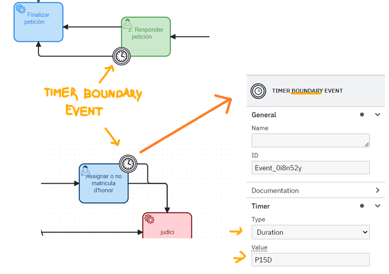
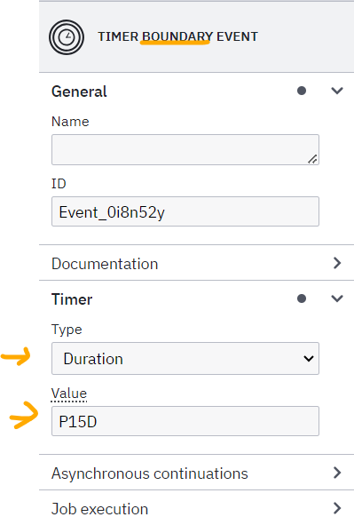
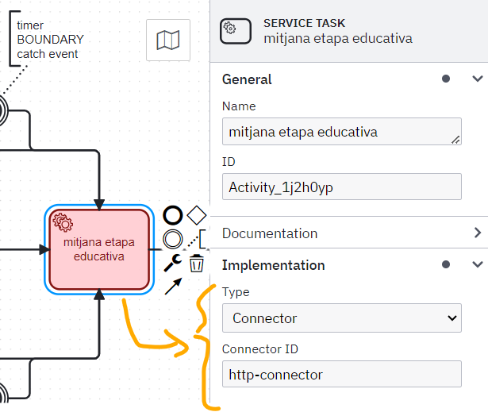
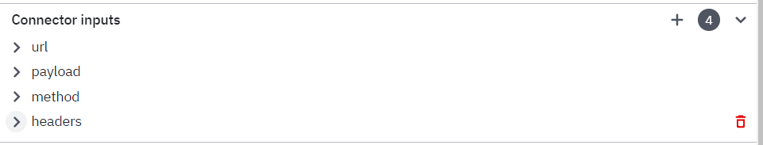
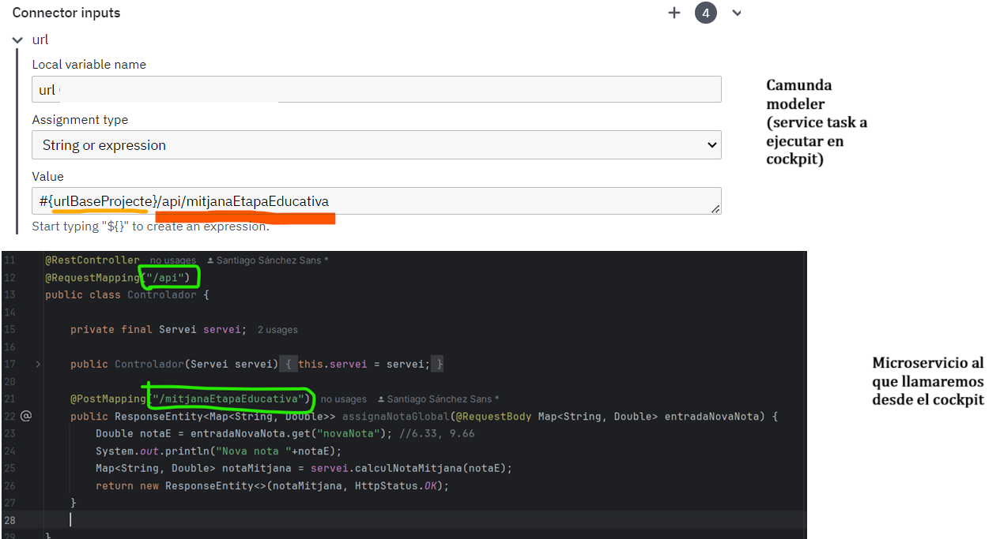
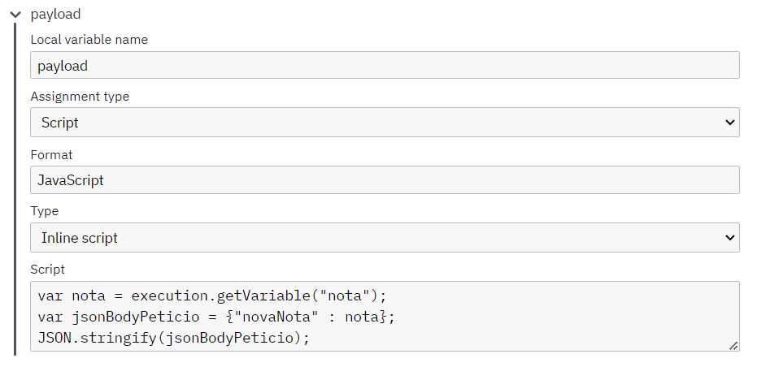
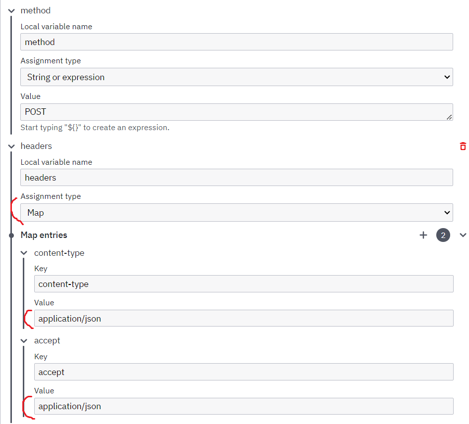
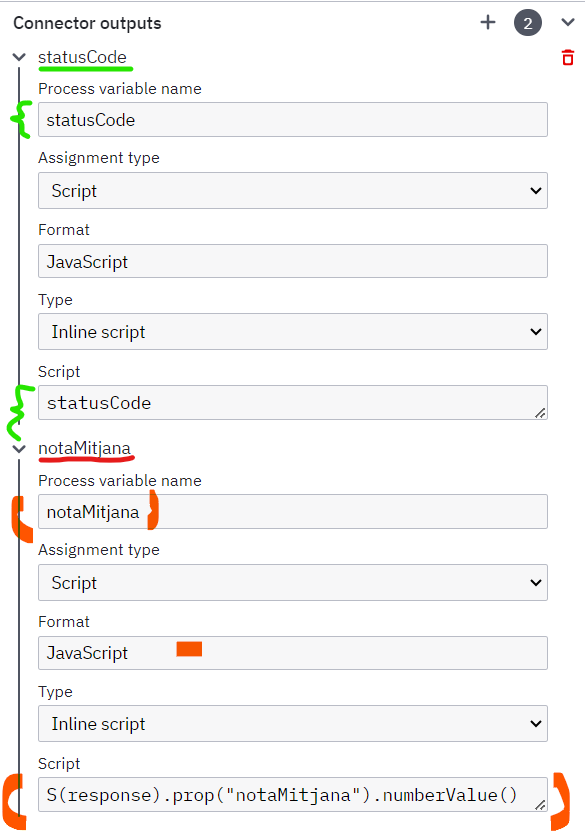
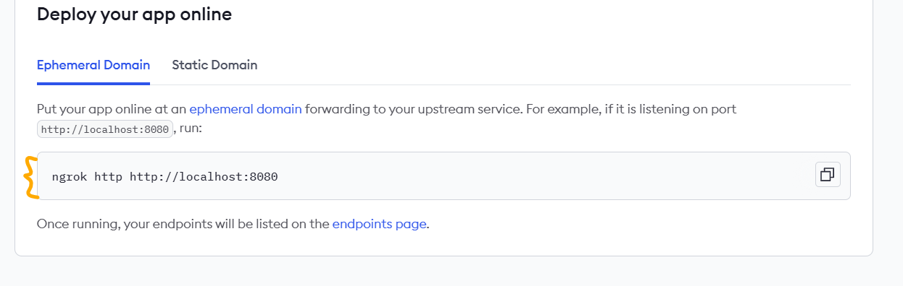
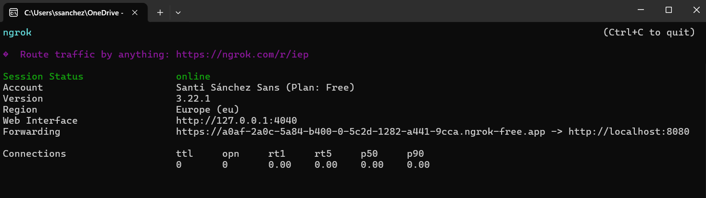

# INTRODUCCIÓN

Este respositorio contiene ejercicios del curso de camunda consultable en este[link](https://github.com/blackcub3s/camundaDiagrams) y ejercicios ideados para ejercitar los conocimientos del mismo orientados a las necesidades de la empresa de las prácticas del grado superior en DAW. 

Se muestran aquí diagramas hechos en camunda modeller versión **5.34**, con la notación o lenguaje *BPMN* (Business Process Model and Notation) y tablas de decisión generadeas con camunda modeller versión **3.7.3** mediante el lenguaje o no tación *DMN* (Decision Management Notation). Se usan dos versiones dado que el camunda platform disponible ya está creado en un cloud y no ha sido objetivo crear uno de cero, sino adaptarse a él.

Tanto BPMN y DMN son creados y mantenidos por OMG (Object Management Group), organización cuyo motivo de existencia es crear estándares para modernizar procesos de negocio en comunión con las necesidades de la industria (ver [link](https://www.sciencedirect.com/topics/computer-science/object-management-group)). Para hacernos una idea, los archiconocidos diagramas UML emanan de esta organización también.

# Introducción a BPMN

El ejercicio siguiente [link](https://academy.camunda.com/c7-platform-java/843268) pide hacer un sistema de QA para controlar qué hacen los empleados: cada vez que un empleado necesita publicar algo lo evalúa él.

La versión hecha inicialmente asume que la evaluación la hace un modelo de NLP y, que si no la peude hacer, la hará un empleado de RRHH (en definitiva, una interpretación libre del enunciado) que se puede consultar aquí pero no es relevante para los objetivos del curso: [link](/img/diagramaTwitter.png). Una versión más sencilla es esta, parecida a la que se recomienda en el curso: 


El *sequence flow*, de arriba ("twit aprovat"), va a ser un camino del flujo si y solo si la expresión ${*twitAprovat*} evalua a cierto. Si twitAprovat fuese *true* el flujo del programa iría a la siguiente tarea de aprobar el twit del usuario ("Publicar twit"):


En caso contrario, si twitAprovat fuese *false* o fuese una variable nula deberíamos asegurarnos que el flujo no se para y que va hacia otro camino: el *default flow* marcado con la rallita nos permite hacer justamente eso como veremos a continuación:


Definimos el *default flow* por seguridad, ya que si la variable **twitAprovat** no estuviera definida e ingenuamente hubiéramos definido en el *sequence flow* que antes era por defecto, una expresión lógica tal como \${*!twitAprovat*} el flujo no iría por ninguna parte. Aunque  \${*twitAprovat*} y \${*!twitAprovat*} sean expresiones plenamente complementarias, no están cubriendo los posibles escenarios del diagrama BPMN: por ejemplo, que no esté definida la variable. Es buena práctica definir, pues, un default flow como hicimos antes, siendo lo siguiente una práctica no muy óptima según lo explicado:


Tomando el diagrama de la penúltima imagen (el que tiene el flujo por defecto) podemos subirlo al camunda remoto en la dirección */engine-rest/* desde el propio camunda modeler:


Si lo hacemos, tendremos ya el diagrama subido al cockpit de camunda, es decir, en la nube (es importante notar que en el diagrama de camunda modeler, en local, definamos un ID de diagrama: este en la nube será la *definiton-key*, que vamos a usar a continuación para iniciar el proceso mediante una solicitud POST):


Como vemos en la documentación de camunda 7.5 [link](https://docs.camunda.org/manual/7.5/reference/rest/process-definition/post-start-process-instance/), para conseguir pasar la variable *twitAprovat* a true en la primera tarea de usuario (Revisar Twit) el usuario deberá hacer una acción manual. Esto se podría traducir en que nuestro cliente, el navegador (con javascript, con typescript -Angular- o el lenguaje que sea), podría recibir un click de una persona que dijera que la revisión es favorable. Al hacer ese click el cliente mandaría una solicitud POST al endpoint de camunda que permite iniciar una instancia de proceso:

En este caso lo que haríamos sería mandar una solicitud a la API de camunda con POSTMAN (que nos hará de cliente) hacia:

 */process-definition/key/**revisio-twit-curs**/start*

Así:


Si la llamada es exitosa y obtenemos el 200 OK, como fue nuestro caso, 
lo que hará Camunda será iniciar la instancia de proceso y nos situará en el primer paso:


Esta llamada anterior se podría hacer, por ejemplo, cuando el usuario entrase a la página front-end de inicio de la tramitación de revisar twit, pero antes de clicar si acepta el+- twit o no.

Luego una vez el usuario clique si aprueba o no aprueba el twit, mandaríamos otra solicitud POST para completar la tarea a este otro endpoint (pasando también por el body, la variable del usuario en cuestion (*twitAprovat*) que luego aprovechará la gateway xor para redirigir el flujo justo después (ver documentación complete [link](https://docs.camunda.org/manual/7.5/reference/rest/task/post-complete/)-)) hacia:


*/process-definition/task/**taskId**/complete*

Para hacerla vamos a necesitar el *TaskId*, que vamos a obtener de User Tasks:


Con este identificador, y pasando la variable que necesitamos en el body, podemos hacer ya la llamada POST:


Con esta llamada, y si obtenemos el código 200 de éxito, el diagrama habrá avanzado al caso en que twitAprovat sea true: es decir, hacia otra tarea de usuario denominada "Publicar twit", en donde el proceso se mantendrá a la espera nuevamente a la siguiente tarea de usuario. Como podemos ver, la variable introducida ahora está dentro de la instancia de proceso particular de Camunda y podrá ser reutilizada por los microservicios que se conecten en nodos posteriores del flujo del diagrama:


Con este enfoque podemos delegar la lógica de espera de respuestas de usuario a Camunda y no tener que estar gestionándola nosotros manualmente com desarrolladores, por ejemplo. Esto simplifica el proceso de desarrollo y hace que se puedan hacer servicios (tanto front-end como back-end) más reutilizables y desacoplados.


# Desarrollando con camunda platform 7

```
NOTE TO SELF: Para la empresa usaremos camunda platform 7.5. Por lo tanto los diagramas BPMN serán en camunda 7, no camunda 8. La documentación debe consultarse en 7.5 no en versiones anteriores.
```

Las tres tareas más importantes que vamos a ver (que no las que salen en el curso) son: user tasks, script tasks y service tasks. Las primeras ya las hemos visto. Existen otras que no son tan relevantes que podemos ver en esta captura del curso:


Las script tasks permiten también añadir variables a través de inline javascript. Finalmente, las service tasks son las más importantes para el rol de un desarrollador java: de la forma como las entiendo permiten procesar información fuera del flujo del diagrama, por así decirlo, mediante microservicios en java.

Las service tasks se puieden definir o implementar de distintsas formas. La más importante para nuestro caso particular son los connectors:


# Trabajando con eventos

Podemos encontrar distintos tipos de eventos (ver la documentación: [link](https://docs.camunda.org/manual/latest/reference/bpmn20/#events)):


El timer boundary event (de tipo intermediate) lo utilizamos bastante.


Hay que diferenciar entre el "*timer **boundary** intermediate event*" y el "*timer **catch** intermediate event*"_ 

- *Timer **boundary** intermediate event*: se asocia con una tarea y se pone al lado de ella -pegado-, generalmente de usuario: consigue que si el usuario no la completa en un tiempo de terminado, ésta siga con el flujo normal del programa sin tener que mandar nosotros la señal rest para terminarla (llamada a rest endpoint "complete"). Es la timer event que utilizamos más en nuestro caso particular. Véase un ejemplo de hacer que un profesor tenga 15 días para poner una matrícula de honor a un estudiante; si no la pone en este período de tiempo, el diagrama seguirá su curso al microservicio rojo debajo de la imagen:



- *Timer **catch** intermediate event*: este evento no se asocia a una tarea, sino que va después de una de ellas. No se suele usar pero un ejemplo sería este:


Existe un tercer tipo, que no solemos usarlo, que me parece interesante: el *Timer **boundary** intermediate event (NON INTERRUPTING)*:  Es como el *Timer **boundary** intermediate event*, pero a diferencia de este no hace que el flujo quede atascado en la tarea asociada al evento. Este se identifica con el círculo escrito en líneas discontinuas. A continuación una vista de la interfaz de camunda modeler 5 para definir 15 minutos de espera:



# DMN

## Explicación general

Podemos simplificar los procesos de decision con una tabla DMN. Tanto el lenguaje BPMN de modelado, como el lenguaje de decisión mediante tablas (DMN) están perfectamente soportados por camunda.

Así las cosas podemos convertir este árbol de decision con la XOR gateway:


En esta tabla mediante DMN:


Para hacerlo necesitamos un tipo de task especial, la *business rule task* que, mediante el ID de la tabla
DMN, convierte el diagrama anterior  que antes tenia la XOR gate conectada con 4 tareas o actividades de servicio, en una sola tarea de negocio -que luego vincularemos con la tabla DMN-:


Para entender las reglas expresadas en una tabla de decision, si solo tenemos una entrada y una salida, la primera columna es la condición (cada fila es una regla) y la segunda columna es el resultado de esa regla. Por ejemplo, podemos verlo en esta tabla:


Se puede verificar distintas formas de definir reglas en los campos de entrada en la siguiente imagen. Mótese que es en sí mismo un lenguaje, denominado FEEL o Friendly Enough Expression Language:


Y ver que se pueden definir expresiones para ver si un string contiene unh substring, aritmetica basica,  if - else statements y funciones varias -se puede consultar el github del proyecto-:


También se puede utilizar el lenguaje por defecto de la camunda platform (JUEL), aunque no sea el lenguaje por defecto de DMN (que es FEEL):


Finalmente hay que mencionar algo muy importante: es necesario tener en cuenta que que tenemos toda la combinatoria posible entre entrada o decision rule y salida (cada una de ellas puede ser única o puede ser múltiple). Esto hay que definirlo pinchando en la business rule task que implemente el diagrama DMN, concretamente en el desplegable *map decision result*: ahí habrá que escoger el par mapper result type, como veremos luego. 

La combinatoria anterior, de hecho, tiene una correspondencia con tipos de datos.:

- 1 entrada y 1 salida → `singleEntry`
- 1 entrada y n salidas → `singleResult`
- n entradas y 1 salida → `collectEntries`
- n entradas y n salidas → `resultList`


Esto, puesto en una tabla podemos mostrarlo así :

| entrada | salida | mapper         | Result Type                    |    decisión adecuada para tablas de decisión con...      |  
|---------|--------|----------------|--------------------------------|-----------------------------------------------------------
| 1       | 1      | singleEntry    | TypedValue                     | Solo una regla (entrada) y solo una salida.              |
| 1       | n      | singleResult   | Map<string, Object>            | Solo una regla (entrada) y múltiples salidas.            |
| n       | 1      | collectEntries | List< Object >                 | Multiples reglas (entrada) y una sola salida.            |
| n       | n      | resultList     | List<Map<string, Object>>      | Multiples reglas (entrada) y múltiples salidas.          |


## Generamos nosotros una business rule: todo el proceso (BPMN + DMN)

Imaginémonos que tenemos que categorizar las notas de un estudiante en función de las categorías 
estándar de no aprobado, suficiente, bien, notable y sobresaliente. En la siguiente imagen veremos que vamos a generar un script que genere aleatoriamente una nota entre 0 y 10, con dos decimales (tarea amarilla), una business rule que llame a una DMN donde podamos categorizar las notas segun las categorías estándar (tarea en lila) y finalmente pondremos una gateway XOR donde se pedirá al profesor que escoja si concede la prerrogativa de asignar la matrícula de honor a alumnos que tengan (nota > 9), o que sea misericordioso y decida aprovar por redondeo a un estudiante suspenso (4.5 <= nota < 5): casos que requerirán una decisión manual. En el default flow no querríamos definir una tarea de usuario en el proceso final, porque la nota y su categorización se asignarán solas; pero definiremos una tarea de usuario solo para recoger el caso que se dará con una probabilidad del 85% al iniciar una instancia de proceso ((1 - (0.5 + 1/10))), es decir, el caso de intervalo de notas $[0, 4.5)$ U $[5, 9)$ que cubre el 85% del espacio del intervalo $[0,10]$. Esto lo hacemos porque sino no podremos visualizar sus variables en el cockpit de camunda platform ("nota" y "categoritzacio") dado que por una cuestión probabilística la mayoría de las veces que iniciemos instancia de proceso el proceso finalizaría llegando al evento final y se cerraría la instancia.

La creación del diagrama BPMN -insistimos, se ha hecho con camunda modeler 5.34 (*icono naranja*)- es esta:


La creación del diagrama DMN asociado a la business rule (tarea lila), que DEBEMOS hacerla con camunda modeler 3.7.3 (*icono verde*) para que no dé problemas al subirlo al camunda platform del cloud es:


Ahora, en este diagrama es indispensable definir cual es la variable de entrada. Para ello, hay que ir al diagrama y clicar en el símbolo "-" (circulo rojo en siguiente imagen), definir la variable nota en "Input Variable" y entonces ya nos va a aparecer en la tabla qué variable de entrada esperará el DMN (la tabla):


La variable de salida NO se define en el DMN, de la misma forma. ¡Cuidado! Esto habrá que hacerlo en el BPMN, en camunda modeller 5.34 (clicando en la **business rule task** del diagrama BPMN, dentro menú de la implementación de la misma). Esto lo haremos informando cuál es la "result variable", que es la que vendrá como *output* del DMN. En caso contrario, no vamos a tener dicha variable de salida como variables de la instancia de proceso en el camunda cloud (en este caso la variable será llamada "categoritzacio" y contendrá un solo string de salida, la categorización de notas). Dado que tenemos también solo un input (un double único de entrada, la nota) y tenemos un string único de salida, tal y como vimos en la tabla anterior, habrá que informar "single entry":


Después de haber informado la single entry hacemos la llamada a la API mediante postman:


Y entonces podremos ya visualizar las variables de la instancia de proceso creada: "nota" y "categoritzacio" en camunda cloud (ver la process definition "diagrama prova business task"):


NOTA: Es extremadamente importante puntualizar que para hacer la conexión entre la **business rule task** del BPMN y el diagrama DMN al que esta llama, debemos utilizar un id. 

El id del diagrama DMN se define aquí:


Mientras que en el BPMN, hay que ir a pinchar en la **business rule task**, encontrar el menú "Implementation" y ahí es necesario informar la "decision reference" (que es el id del diagrama DMN anterior):


Finalmente, falta mencionar que hay que desplegar el diagramaa DMN al camunda platform mediante camunda modeler (3.7.3) dándole al icono de subir:


Análogamente hay que hacer el despliegue también al camunda platform del diagrama BPMN mediante camunda modeler 5.34:


## Limpiar todas las instancias de proceso de un proceso en cockpit en la fase de diseño (tanto última versión de la definición de proceso como en versiones anteriores)

Para hacer pruebas, estamos todo el rato generando instancias de proceso que no terminan si hay tareas de usuario.

Para terminarlas tenemos que entrar en cada instancia de proceso, clicando encima de su ID y hacer llamada al endpoint:

/engine-rest/task/{taskId}/complete

Cuando un proceso esté en producción esto se va a solucionar programáticamente (cada tarea de usuario va a recibir su llamada al endpoint de complete una vez se haya completado, a partir de la acción del propio usario); pero al diseñar el diagrama podemos terminar con varias instancias de proceso bloqueadas porque no tenermos usuarios que las paren: manualmente hacerlo es laborioso -hay que entrar en cada actividad, mirar instancias de proceso, clicar en cada instancia, ir a "UserTasks" y ahí copiar el taskID para pasarlo al endpoint anterior. La solución para ello está en definir *intermediate timer events*, como veremos luego.


# Diagramas más complejos

# Service task + business rule + timer event 

Modificaremos el diagrama anterior del profesor para que tenga unos instantes para asignar la matrícula de honor o asignar el suspenso, si se da el caso, desde que recibe el flujo en las tareas de usuario.

De este modo solucionaremos el tema de tareas de usuario no completadas (de hecho es así como se hace). A una persona se le puede dar un tiempo limitado para hacer una tarea; pero si no la efectúa el flujo del diagrama no podría continuar. Por esa razón le dejamos un tiempo para que la realice y si no lo hace se sigue a la siguiente actividad de forma automática. Esto es típico en las administraciones: si un expediente no se ve resuelto por un funcionario en un plazo determinado, este procedimiento pasa a una fase distinta o se archiva, pero no se debería parar *sine die*.

Además, también eliminaremos la tarea de usuario intermedia que nunca usábamos más que para visualizar los datos y finalmente añadiremos al final del flujo una tarea de servicio que recogerá los datos de usuario una vez sean introducidos o el timer boundary event haga que el flujo avance sin respuesta del mismo.


## Creación de la service task: mitjana etapa educativa

En esta service task "mitjana etapa educativa", a través de camunda modeler 5, vamos a llamar a un microservicio en java. Este servicio se va a orquestrar mediante llamadas HTTP de tipo REST, con una implementación de *connector*;




> 📦 **Nota sobre el entorno del microservicio**
>
> Como veremos luego el microservicio, este estará corriendo en el `localhost:8080` (no lo desplegamos en el sistema de la empresa) mientras que el Camunda está en la infraestructura cloud de la empresa. Por lo tanto, la única forma de poder hacer llamada es, en nuestro caso, salir públicamente a internet a través de una IP dinámica usando una URL generada con *ngrok*, como veremos en el siguiente apartado.
>
> En el apartado actual nos seguiremos centrando en configurar la *Service Task* **"mitjana etapa educativa"** para que pueda hacer una llamada al microservicio.


Habiendo dicho la forma como se conecta esta service task al back end, dado que usamos **connector**, hay que definir manualmente varios parçámetros en **connector inputs**. TODOS ellos se deben escribir exactamente comot al, sino no funcionan:




*Primero* tenemos la **url**. Aqui simplemente definimos la URL a la que haremos la petición POST desde el camunda platform del cockpit de camunda. La URL de la siguiente captura (en ambar, se tomará de la instancia de proceso) tiene el endpoint a la derecha (en rojo), y ese endpoint va a llamar al microservicio del backend de la caputra del controlador del microservicio como vemos abajo (en verde):



*Segundo*, tenemos el payload o el body de la petición POST que camunda platform hará a nuestro microservicio:



Esta anterior captura, ese jsonBodyPeticio, simplemente estará entrando por la línea del controlador con el nombre de _entradaNovaNota_:

https://github.com/blackcub3s/camundaDiagrams/blob/3a991d3fa91452846e25e6a4cb815dd9b22bb79f/tasquesServei/mitjanaEtapaEducativa/src/main/java/com/example/mitjanaEtapaEducativa/Controlador.java#L24

*Tercero* y *cuarto*, tenemos method y headers con sus map entries, respectivamente. Method informa que haremos una solicitud POST y headers informa como van a pasar los datos (tanto en la petición como la response, se hará en formato JSON -pares clave:valor, del estilo javascript object-):



Finalmente **connector outputs**. Definimos el _statusCode_ que simplemente recoge el código de esatdo del microservicio al que habíamos llamado; y luego la variable _notaMitjana_ que recogerá los datos que el microservicio devuelve en forma de json, como esto: **{"notaMitjana" : 6.234}**. 

NOTA: MUY importante que uses stateCode y no otros nombres como codiEstat. Y FEEL por lo visto no lo soporta el camunda 7 de la emrpesa.



Finalmente ya podemos deployear el diagrama BPMN (la decision definition ya está deployeada de antes).


## Creación del microservicio y salida a internet

Nuestro microservicio está en el lcoalhost y no vamos a utilizar la infraestructura de la empresa. Así, para ello usaermos ngrok para sacar a internet nuestros endpoints locales rápidamente para hacer pruebas:

Para ello creamos nuestra cuenta de ngrok, isntalamos ngrok en nuestro sistema, y en la url siguiente [https://dashboard.ngrok.com/get-started/your-authtoken](https://dashboard.ngrok.com/get-started/your-authtoken) vamos a obtener el token que aqui aparece anonimizado y corremos este comando (sin anonimizar) en nuestra terminal:

```
ngrok config add-authtoken $YOUR_AUTHTOKEN
```
Luego usamos el ephemeral domain https://dashboard.ngrok.com/get-started/setup/windows:




Y lo corremos en la terminal también pero adaptado el puerto a spring boot (que es el 8080):
```
ngrok http http://localhost:8080
```

Y si todo va bien tendremos esto:



Y ya podremos hacer llamadas POST desde cualquier origen en internet. Por lo tanto, ahora nuestro microservicio en springboot será accesible desde camunda, desde la service task del diagrama.

El microservicio en cuestión simplemente tomará los datos del "connector input" que tendrán la estructura en JSON. Por ejemplo:

``` {"nota" : 9.65} ```

Acto seguido calculará la media aritmética de esa nota conjuntamente con otras notas internas del microservicio (a modo de prueba) y devolverá por le body de la response POST lo siguiente (el numero es variable)


``` {"notaMitjana" : 6.32} ```

Todas las llamadas que hagamos a localhost:8080 desde nuestro ordenador, podrán hacerse tambie´n desde el mismo (o desde cualquier otro) al dominio https://a9af-2a...etc. Cuidado que esta URL base puede ser reseteada, no es un dominio estático y se deberá ajustar en reejecuciones de este programa.

Ahora vamos a informar a camunda con el inicio del a tarea de servicio de la base URL al inciiarla: